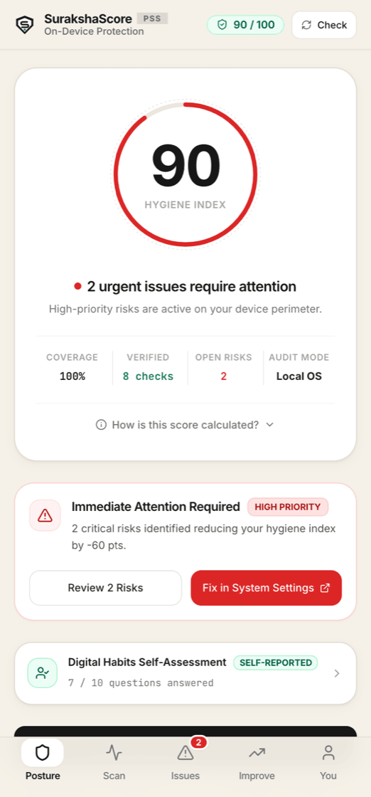
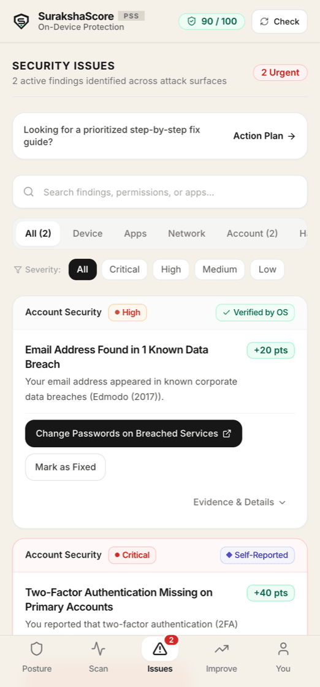
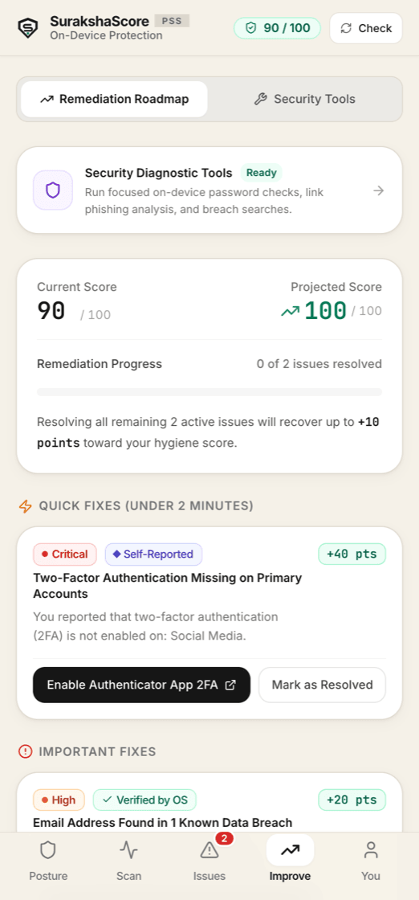
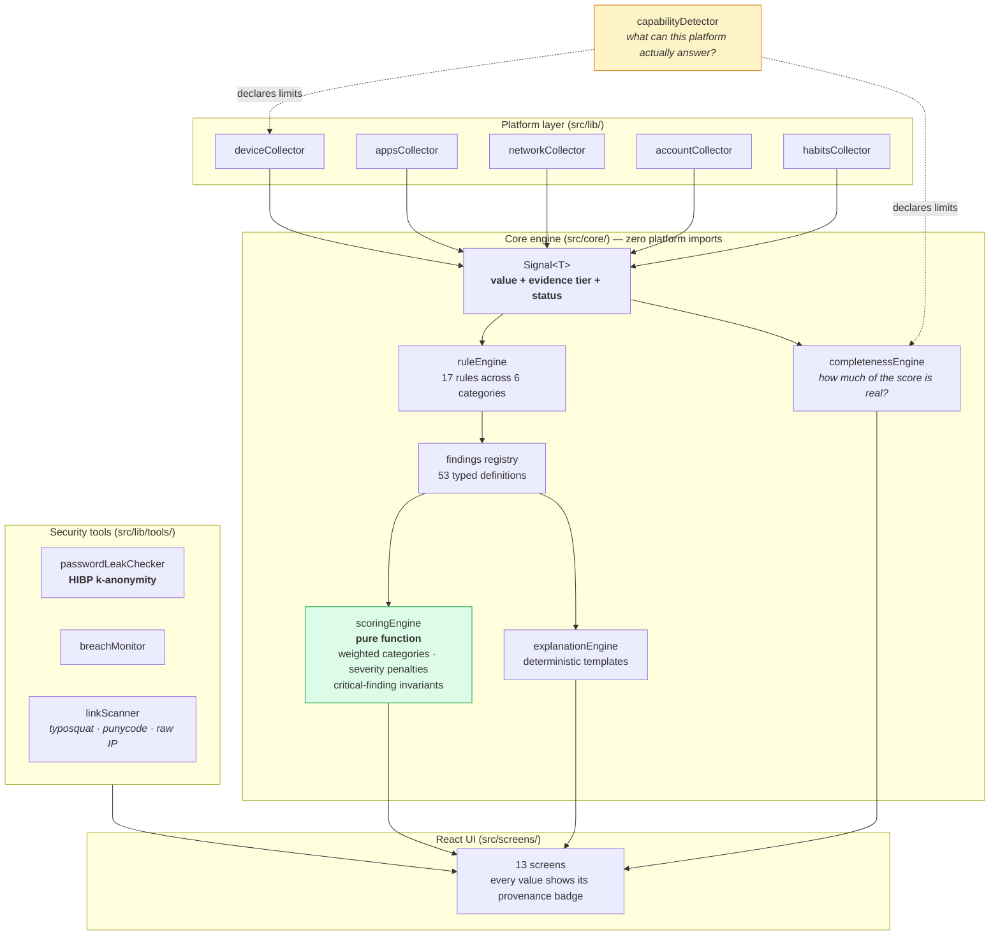
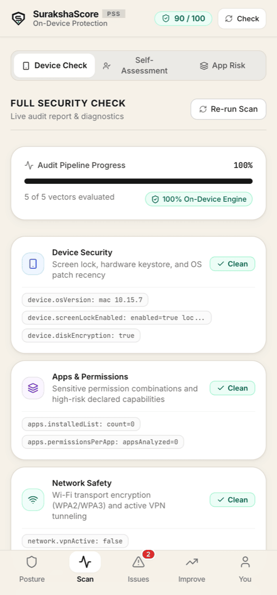
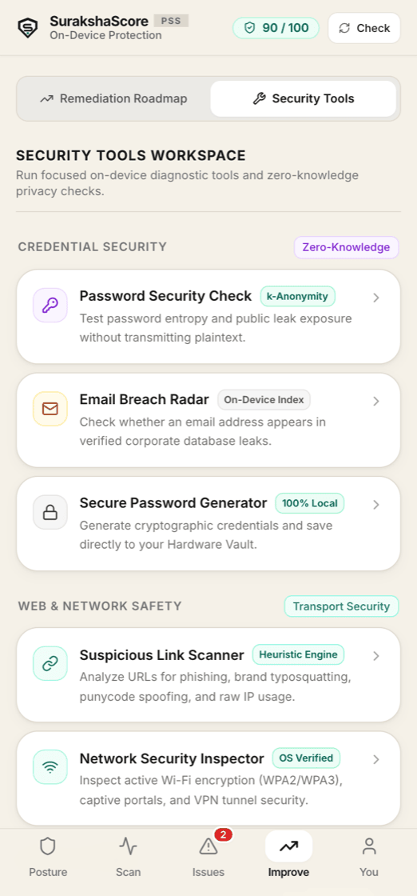
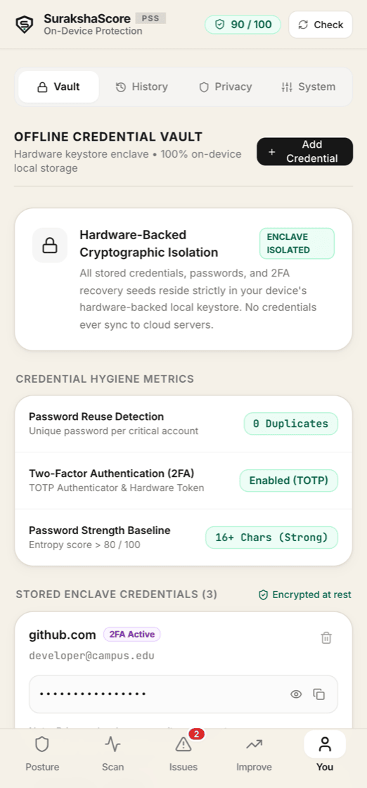

# SurakshaScore

**A personal digital hygiene scanner that turns device, account and privacy
posture into one explainable security score.**

Most security apps show you a number. SurakshaScore shows you the number, every
signal that produced it, **and how much that signal is actually worth** — because
"your screen lock is on" verified by the operating system is not the same claim
as "you told us your screen lock is on".

[](https://github.com/sgtsujith141-wq/surakshascore/actions/workflows/ci.yml)
[](#testing)
[](https://www.typescriptlang.org/)
[](https://react.dev/)

| Posture | Issues | Remediation |
|---|---|---|
|  |  |  |

---

## The problem

Consumer security apps have a credibility problem. They present a single score
with no derivation, mix verified facts with guesses, and quietly default a field
to "pass" when the platform will not tell them the answer. A user has no way to
tell which parts of the score are real.

That last failure is the serious one. If an app cannot read your OS patch level
— and on the web it genuinely cannot — it has three options: omit the category,
guess, or ask you. Two of those produce a number that looks authoritative and
is not.

## What I built

A scanner built around one rule: **every displayed data point carries its
provenance, and unavailable is a first-class outcome.**

1. **Five collectors** gather signals across device, apps, network, account and
   habits.
2. Each signal is tagged with an **evidence tier** — hardware-attested, OS-API
   verified, heuristic, or self-reported — which carries a **weight factor**
   into the score.
3. A **rule engine** evaluates 17 rules against the signals, producing findings
   from a registry of 53 typed finding definitions.
4. A **pure scoring function** turns findings into a 0–100 score with a
   published per-category breakdown. Same signals in, same score out, always.
5. An **explanation engine** generates finding copy deterministically from typed
   templates — **no runtime LLM calls**, so the app cannot invent a security
   claim.

The `src/core/` engine is platform-agnostic by construction: it imports no
React, no Capacitor, no browser globals. **A test enforces this** — see
[Engineering decisions](#engineering-decisions-and-trade-offs).

## Architecture



### The evidence tier model

Every signal declares how it was obtained, and that determines its weight:

| Tier | Name | How it was obtained | Weight |
|---|---|---|---|
| 1 | Hardware Attested | Secure enclave / KeyStore | **1.00** |
| 2 | OS API Verified | Trusted operating-system API | **0.90** |
| 3 | Heuristic | Manifest inspection, static analysis, network probe | **0.75** |
| 4 | Self-Reported | User questionnaire | **0.60** |

A self-reported "yes, I have 2FA" is worth 0.60 of an OS-verified one. Both are
shown, labelled, and counted — neither is silently discarded or silently
promoted.

### Scoring

Six weighted categories, summing to exactly 1.0:

| Category | Weight |
|---|---|
| Account security | 0.35 |
| Device safety | 0.20 |
| Phishing & fraud | 0.20 |
| Privacy | 0.10 |
| Backup & recovery | 0.10 |
| Update hygiene | 0.05 |

Each category starts at 100 and takes severity-weighted deductions. An
**invariant** then caps the result: while an open critical finding exists the
overall score cannot exceed 79, with a further penalty per additional critical.
A screen that says "94/100" while a critical issue is open is exactly the
dishonesty this project exists to avoid.

## Verified features

- **Staged scan across six categories** with live per-vector progress.
- **Provenance on every data point** — `VERIFIED`, `PERMISSION_BASED`,
  `SELF_REPORTED`, `UNAVAILABLE`. When a platform API cannot supply a value the
  field renders as unavailable rather than defaulting to a pass.
- **Completeness reporting** — the app states how much of the score rests on
  verified evidence rather than presenting a partial score as a whole one.
- **Deterministic explanations** for every finding, generated from typed
  templates.
- **Password leak checker** — a real integration with the Have I Been Pwned
  range API using **k-anonymity**: the password is SHA-1 hashed locally, only
  the first 5 hex characters of the hash are sent, and the suffix is matched
  against the returned range client-side. Neither the password nor its full
  hash leaves the device. Falls back to an offline list if the network is
  unavailable.
- **Link scanner** — heuristic detection of phishing indicators: brand
  typosquatting, punycode spoofing and raw-IP URLs.
- **Local credential vault** and breach monitor.
- **Android build** via Capacitor.

<details>
<summary>More screenshots — staged scan, security tools, profile</summary>

| Scan pipeline | Security tools | Profile |
|---|---|---|
|  |  |  |

</details>

## Tech stack

React 18 · TypeScript (strict) · Vite 5 · Tailwind CSS 3 · Capacitor 7
(Android) · Vitest · Lucide icons. **No backend, no accounts, no telemetry.**

## Installation

Requires **Node 20+**.

```bash
git clone https://github.com/sgtsujith141-wq/surakshascore.git
cd surakshascore
npm install
npm run dev
```

Then open <http://localhost:5173>.

### Android

```bash
npm run build
npx cap sync android
npx cap open android      # requires Android Studio and the Android SDK
```

## Configuration

**There are no environment variables and no secrets.** The app has no backend
and no API keys. The only outbound request the application makes is the Have I
Been Pwned range lookup, which is unauthenticated, sends only a 5-character
hash prefix, and fails closed to an offline list.

Scoring is configured in code rather than by environment — category weights,
severity penalties and the critical-finding invariants all live in
[`src/core/config/scoringConfig.ts`](src/core/config/scoringConfig.ts) and are
passed into the engine, so an alternative weighting can be supplied without
touching the engine itself.

## Testing

```bash
npm run typecheck   # tsc --noEmit, strict
npm test            # vitest run
npm run build       # typecheck, then production build
```

**107 tests across 21 files, all passing.** Typecheck is clean.

| Area | Covers |
|---|---|
| `tests/core/scoringEngine` · `invariants` | Score determinism, weight renormalisation, the critical-finding ceiling |
| `tests/core/rules` (19 tests) | Every rule's trigger conditions |
| `tests/core/ruleEngine` · `completeness` · `explanations` | Evaluation order, completeness maths, template rendering |
| `tests/core/isolation` | **That `src/core` imports no React, Capacitor, or browser globals** |
| `tests/collectors/*` | All five collectors, including unavailable-signal handling |
| `tests/tools/*` | Password entropy and k-anonymity lookup, link scanner heuristics, breach monitor |
| `tests/pipeline` · `tests/registry` · `tests/mock` | Scan orchestration, finding registry integrity, demo profiles |

One test (`passwordLeakChecker`) performs a live HIBP range request. It is
free, unauthenticated, and the code path falls back to an offline list, so the
suite passes without network access.

CI ([`.github/workflows/ci.yml`](.github/workflows/ci.yml)) runs typecheck,
tests and a production build on Node 20 and 22.

## Engineering decisions and trade-offs

**Provenance is a type, not a label.** `Signal<T>` carries its `EvidenceTier`
through the whole pipeline, so a self-reported value cannot be displayed as
verified — the type system does not allow the tier to be dropped. *Trade-off:*
every collector is more verbose than one that just returns a boolean.

**The core engine is platform-agnostic, and a test enforces it.**
`tests/core/isolation.test.ts` walks every file in `src/core/` and fails if any
of them imports React, Capacitor, `lucide-react` or `@supabase`, or touches
`window`, `document`, `localStorage` or `navigator`. Architecture rules that are
only written down get violated; this one breaks the build. It is also what makes
the engine testable without a DOM, which is why 107 tests run in about two
seconds.

**Scoring is a pure function of signals.** No timestamps, no randomness, no
network. The same signals always produce the same score, which is what makes the
breakdown auditable. *Trade-off:* no personalisation or trend-based adjustment.

**Explanations come from typed templates, not an LLM.** A language model
generating security advice at runtime can produce a confident, wrong, unbounded
claim — and it cannot be unit-tested. Templates can. *Trade-off:* the copy is
less fluent and every new finding type needs a written template.

**Unavailable is a rendered state, not a default.** When the platform cannot
answer, the UI says so and the completeness engine reduces the confidence of the
whole score. The tempting alternative — treat unknown as pass — inflates every
score on every platform that restricts the API. *Trade-off:* the app looks less
capable on the web than a competitor willing to guess.

**k-anonymity for the leak check, or no leak check.** Sending a password, or
even its full hash, to a third party to ask whether it is safe is
self-defeating. The 5-character prefix reveals membership of a bucket of
hundreds of hashes and nothing more. *Trade-off:* a larger response to filter
client-side.

**Capacitor rather than React Native.** One TypeScript codebase serves both the
web demo and the Android build, and the core engine is shared rather than
reimplemented. *Trade-off:* native signals need a plugin bridge — which is the
main limitation below.

## Known limitations

Stated plainly, because a security app that overstates what it verified is worse
than one that verifies nothing.

- **The browser scan runs on a mock signal provider.** In the web build, signals
  come from selectable demo profiles, **not from your actual machine** — a
  browser cannot read OS patch level, screen-lock state or installed-app
  permissions. The pipeline, rule engine, scoring and findings running over
  those signals are real; the inputs are simulated. The screenshots above are
  the real UI over demo data.
- **The Android collectors are not fully wired to native plugins.**
  `deviceCollector` exposes a `nativeBridge` interface for patch date, screen
  lock, developer options, unknown sources and storage encryption; a native
  implementation still has to be supplied before those return genuinely
  verified device data. Until then Android reports them as unavailable rather
  than guessing — which is correct, but means the Tier 1 and Tier 2 paths are
  currently exercised only by tests.
- **The local vault is a UI demonstration, and its own label overstates it.**
  It is seeded with clearly-labelled fictional entries and held in React state,
  so nothing survives a reload. The screen displays the badge "Encrypted at
  rest", and **that is not implemented** — the only `crypto.subtle` call in the
  codebase is the SHA-1 digest used for the k-anonymity leak check. The badge
  is a leftover from the visual design and should be removed or made true
  before the vault is presented as a feature. (Real client-side encryption,
  PBKDF2-SHA256 with AES-GCM, exists in the
  [predecessor repository](https://github.com/sgtsujith141-wq/surakshascore-mvp).)
- **The link scanner is heuristic.** It detects typosquatting, punycode and raw
  IPs; it does not consult any reputation feed and will miss novel phishing.
- **No persistence.** No backend, no accounts, no sync. State is in-memory and
  lost on reload.
- **Not independently audited.** The scoring model is my own design, informed by
  the specification in `PSS-Engineering-Spec.md`; it is not a recognised
  standard.

## Future development

- Implement the Android `nativeBridge` so Tier 1 and Tier 2 signals are real on
  device — the single change that would most increase the score's meaning.
- Persist scan history locally so the Timeline screen shows genuine trend data.
- Move the link scanner from pure heuristics to an on-device blocklist.
- Harden the vault (or remove it) — a demonstration vault in a security app is a
  liability if a user mistakes it for a real one.
- iOS target via Capacitor, with the same unavailable-not-guessed discipline.

## Repository layout

```
src/
  core/                 platform-agnostic engine — no React, no Capacitor
    models/             Signal, Finding, ScanResult, CategoryScore
    types/              evidence tiers, categories, severity, platform
    rules/              17 rules across 6 categories
    engine/             scoring · rules · completeness · explanations
    config/             category weights, penalties, invariants
  lib/
    collectors/         5 signal collectors
    findings/registry   53 typed finding definitions
    tools/              password leak checker, breach monitor, link scanner
    pipeline/           scan orchestration
  screens/              13 React screens
  components/           navigation and UI primitives
tests/                  107 tests across 21 files
android/                Capacitor Android project
docs/images/            screenshots
PSS-Engineering-Spec.md the specification this was built to
```

## Project history

SurakshaScore is a clean-room rebuild. The original prototype is preserved at
**[surakshascore-mvp](https://github.com/sgtsujith141-wq/surakshascore-mvp)** —
it proved the product ideas (guided checkup, remediation playbooks, encrypted
vault, k-anonymity breach check), and this repository replaced the engine
underneath them with the provenance model, the pure scoring function and the
test suite.

---

**Author:** Sujith C · Computer Science & Engineering
